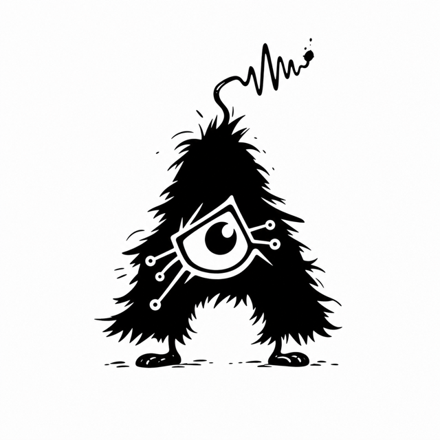
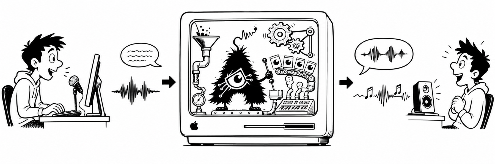
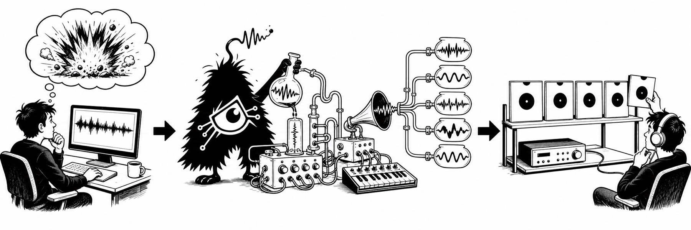

# Audex-Mac

<p align="center">
  
</p>

Audex-Mac runs NVIDIA's Nemotron-Labs-Audex speech and sound models locally on
Apple Silicon. Talk to your Mac, let it talk back, or ask it to manufacture a
small rack of weird noises.

## Disclaimer

In case it is not abundantly clear, this repo is mostly vibe-coded with
GPT5.5 High (and then 5.6 sol when it came out) in Codex.
I wanted to figure out if a coding agent could take a vllm-metal checkpoint
and support an otherwise totally-unsupported model on Mac, and the answer was
"yes, it can, poorly". With a few tweaks and steering and a lot of prior
knowledge playing with ASR/LLM/TTS pipelines in my past, eventually it reached
"acceptable result."

## Why does this exist?

The typical reasons to run AI locally are, like, privacy, repeatable scale,
classifier-free queries, stable model choice, and cost. Once a model is on your
disk, it is yours.

Cost, admittedly, is funny. A similarly equipped 128 GB / 4 TB M5 Mac was
$8,149 from Apple in mid-2026. The tokens are nearly free once you exclude
the machine from the accounting; I could run my Mac flat-out at a cost of
$0.50/kWh and 100 watts of power consumption and the cost is $1.20 a day,
even in California where PG&E's extortionate relationship with the CPUC
makes power ridiculous. Macs are very power-efficient per token.

Me? I just wanted to talk to my Mac and have it make cool noises.
I've been a songwriter since I was 7 years old (I am Gen-X, that means "long-ass
time ago to you youngsters"). I love figuring out how stuff works.

Therefore, an absurdly over-engineered sampler for
Logic Pro or Bitwig sounded more interesting than another obedient chatbot.

Audex-Mac is a Rube Goldberg synthesizer using a language model. The model is okay,
but definitely not "I have Mythos at home."

PC support is a non-goal. My 5800X3D, RTX 4080 with 16 GB VRAM, and 64 GB DDR4
machine is currently a Baldur's Gate 3 and flight-sim appliance. In AI terms, my
PC is "GPU-poor".

Gooning, roleplay, and other SillyTavern/Marinara Engine-adjacent "research"" with this model
*are currently untested*. Please do not file issues for the model being too
safety-aligned by nVidia. Go Heretic it yourself if you want to un-safetymaxx it.

## Build

This ride has a minimum height limit. It is for Apple Silicon Macs.
You need native arm64 Python 3.12 or 3.13,
enough disk for the model and runtime, and sufficient RAM:

- Audex 2B BF16: **24 GB recommended**
- Audex 30B-A3B NVFP4: **48 GB recommended**
- Audex 30B-A3B BF16: **96 GB recommended**

Could an eventual NVFP4 2B squeeze into 16 GB? Perhaps. My initial analysis says
it would be tight, swap-happy, and not worth the quality trade. It should fit
comfortably at 24 GB, where the existing BF16 model already fits. So: maybe.

```sh
git clone https://github.com/mbarnson/Audex-Mac.git
cd Audex-Mac
```

There is no ceremonial build dance. The first run creates the local environments,
installs the pinned runtime, finds cached models, and asks before downloading one.

## Run

For the full browser chat, speech, understanding, and sound studio:

```sh
./start.sh web
```

The browser opens on `http://127.0.0.1:8765`. It supports text, microphone, and
audio-file input; written, spoken, and generated-audio output; editable Audex
conversation titles; persistent history; and visible transcripts for every
speech turn. Switch between text-to-text, text-to-speech, speech-to-text, and
speech-to-speech inside one conversation without resetting its model history or
vLLM cache identity.

The first non-speech generation request lazily loads the XCodec and enhancement
decoders used by `sound.sh`. Generated variations appear immediately with their
captions and players; the browser does not use Sound Lab's blind-voting/reveal
flow. To keep the browser in the background or select a cached model explicitly:

```sh
./start.sh web --no-open --model 2b
./start.sh web --no-open --model 30b-nvfp4
```

Allow microphone access when the browser asks. Audex converts microphone and
file audio to 16 kHz mono WAV locally before sending it to the localhost server.
Nothing is uploaded to a cloud service.

For a typed or push-to-talk conversation:

```sh
./start.sh
```



At `You:`, type and press Enter. Submit an empty prompt to start recording, then
press Enter again to stop. Shift+Enter inserts a newline in most sensible
terminals; Option+Enter is the fallback. Type `q` by itself to quit.

For the currently-experimental, time-sucking, weird sound-making workbench:

```sh
./sound.sh
```



Describe a sound. Audex makes five candidates and opens a local blind audition
board. Pick with your ears before revealing what prompt prompted those vectors.

## Test

```sh
python3.12 -m venv .venv
.venv/bin/python -m pip install -e '.[dev]'
scripts/lint.sh
.venv/bin/python -m pytest -m fast
```

## Documentation

Benchmarks, licenses, constraints, architecture, patch history, quality evidence,
diagnostics, and the rest of the fiddly bits live in the
[documentation map](docs/README.md).

GLHF
