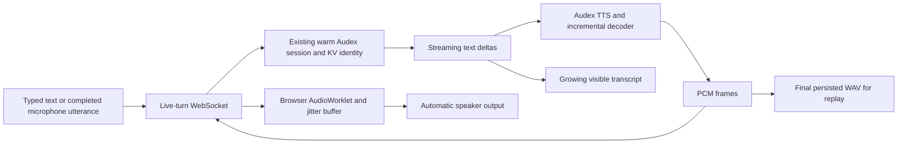

# Browser Low-Latency Speech Streaming

## Status

Approved design. Implementation pending.

This design makes the browser's spoken-output modes behave like the terminal
conversation launched by `./start.sh`: the user finishes an utterance or submits
text, Audex begins playing the response as soon as usable PCM is decoded, and
generation continues while the response is already audible.

The final WAV remains useful for replay and history. It is not the live delivery
mechanism.

## Experience Contract

### Text in, Speech out

1. The user submits text with Enter.
2. The user bubble appears immediately.
3. The assistant transcript grows while text is generated.
4. The first decoded speech begins playing automatically without another click.
5. Later PCM continues playing without gaps while generation remains in progress.
6. The completed bubble retains a compact replay control backed by the final WAV.

### Speech in, Speech out

1. The user starts recording and presses Enter or the microphone control to finish.
2. The browser submits the completed utterance and immediately shows a pending
   user transcript.
3. Audex begins speaking when the first response PCM is available.
4. The final user and assistant transcripts remain visible in the conversation.
5. The composer returns to its ready-to-record state when playback finishes.

Selecting a speech-output mode therefore means that Audex speaks automatically.
Mute is a persistent conversation preference; Play is a historical replay action.

## Current Gap

The browser currently records an entire WAV, base64-encodes it into one JSON
request, waits for the synchronous turn to finish, and renders the resulting
`audio_url` with native `<audio controls>`. The web runtime also invokes spoken
turns with `play=False`. Consequently, the browser receives no audio until the
model response, speech generation, decoder flush, artifact write, conversation
commit, and HTTP response have all completed.

Adding `autoplay` to the final `<audio>` element would remove one click but would
not reduce time to first audible speech. The browser must consume the same
incremental PCM stream used by the terminal playback path.

## Architecture



The streaming-turn Module owns the complete turn lifecycle. Its Interface emits
ordered turn events while its Implementation hides model text streaming, TTS
chunking, codec-token scheduling, decoder state, PCM generation, final WAV
persistence, conversation commits, and cache bookkeeping.

The PCM output Seam has multiple real Adapters:

- the terminal Adapter writes PCM to `sounddevice.RawOutputStream`;
- the browser Adapter frames PCM for the live-turn WebSocket;
- the test Adapter records events and PCM without audio hardware.

This keeps one speech Implementation and concentrates buffering, cancellation,
metrics, and artifact correctness in one place. The browser does not construct a
second TTS or decoder path.

## Streaming-Turn Interface

A live turn is an ordered stream of control events plus binary PCM frames. The
initial Interface is intentionally small:

```text
turn.started
user.transcript.final
assistant.text.delta
assistant.audio.started
assistant.audio.pcm
assistant.audio.finished
turn.finished
turn.failed
```

Control events are JSON. PCM is sent as binary WebSocket messages with the turn
ID, monotonically increasing sequence number, sample rate, channel count, and
sample format established by `assistant.audio.started`. The first implementation
uses mono signed PCM16 because the decoder already produces it and the connection
is loopback-only. It avoids base64 overhead and avoids introducing a lossy codec
into the model-output path.

`turn.finished` contains the durable message representation and final replay URL.
It is not a prerequisite for playback. Event ordering guarantees are:

- `turn.started` precedes every other event;
- `assistant.audio.started` precedes the first PCM frame;
- PCM sequence numbers are contiguous within an uninterrupted turn;
- `assistant.audio.finished` follows the final PCM frame;
- exactly one of `turn.finished` or `turn.failed` terminates the turn.

The direct audio-response path is allowed to emit assistant audio before the final
user transcript. That ordering preserves its latency advantage. The pending user
bubble is replaced when `user.transcript.final` arrives.

## Server and Runtime

The live-turn transport resolves the chat once and holds its existing serialized
turn lease until completion or cancellation. It uses the same warm
`VllmSpeechToSpeechSession`, conversation ID, message history, and vLLM cache key
already selected by the browser chat.

Mode changes alter input and output Adapters only. They must not create another
session, clear the conversation state key, or commit a synthetic intermediate
message. Text in/Text out, Text in/Speech out, Speech in/Text out, and Speech
in/Speech out continue appending to one cache-preserving conversation.

The speech synthesizer writes every emitted PCM frame both to the selected live
Adapter and to the existing streaming WAV writer. After successful generation,
the coordinator atomically commits the user and assistant messages and exposes
the completed WAV through the existing chat-scoped media route.

If generation fails or the client disconnects, the server closes the PCM Adapter,
releases the turn lease, and does not persist a falsely completed assistant
message. Cancellation semantics for deliberately interrupted partial responses
will be specified with barge-in rather than guessed by the first release.

## Browser Playback

The browser owns one long-lived `AudioContext` for conversational playback. The
first microphone or send gesture resumes it while the browser still considers the
operation user-initiated. Later assistant frames can therefore start without a
per-message playback click.

An `AudioWorklet` consumes a PCM ring buffer. The main thread:

1. validates turn and sequence metadata;
2. converts PCM16 frames to the worklet's float representation;
3. queues a small initial jitter buffer;
4. starts output automatically when that buffer is ready;
5. reports underruns, queued audio duration, and first-playback timing;
6. drains through `assistant.audio.finished` before marking the turn complete.

The CLI currently uses an 80 ms prebuffer for interleaved speech and requests
low-latency output. The browser should begin with the same 80 ms target, measure
underruns on real hardware, and tune from evidence rather than increasing the
buffer preemptively.

Native `<audio>` controls remain available only as a compact replay surface after
the final artifact exists. They are not mounted as the live player.

## Visible Turn States

The conversation presents one clear state at a time:

```text
Ready -> Recording -> Submitting -> Thinking -> Speaking -> Ready
                                      |             |
                                      +-> Failed <--+
```

The assistant bubble exists during Thinking and Speaking. Text deltas update its
visible transcript in place. Speaking shows a lightweight animated waveform and
a Stop action rather than a native audio timeline. Completion replaces that live
indicator with the compact replay control.

The first release retains push-to-talk input. An opt-in hands-free conversation
loop, microphone endpointing, and barge-in require additional cancellation and
echo-handling contracts; they can build on the same WebSocket and playback
Adapter without changing the basic streaming-turn Interface.

## Verification Contract

The feature is complete only when tests and local evidence demonstrate:

- first assistant PCM is delivered before `turn.finished` and before the final
  replay URL exists;
- Text in/Speech out and Speech in/Speech out require no playback click after the
  user's submit or stop-recording gesture;
- assistant transcript deltas remain visible and the final transcript matches the
  persisted message;
- concatenated streamed PCM matches the audio portion persisted to the final WAV;
- PCM sequence gaps, duplicate frames, and late frames from an obsolete turn are
  rejected;
- a browser disconnect closes playback and releases the serialized turn lease;
- switching among the four conversational modes preserves the same conversation
  and cache identity;
- reloading the page shows completed transcripts and replayable final WAVs;
- measured first-audio, first-playback, jitter-buffer depth, and underrun counts
  are recorded during local hardware UAT.

Tests cross the streaming-turn Interface rather than reaching into decoder or
WebSocket internals. A recording Adapter provides deterministic PCM assertions;
browser tests use synthetic PCM to exercise the worklet and visible lifecycle
without loading model weights.

## Delivery Slices

1. Introduce the PCM/event Adapter Seam and prove existing terminal playback and
   final WAV output remain unchanged.
2. Deliver one Text in/Speech out turn over the WebSocket to automatic browser
   playback before turn completion.
3. Add Speech in/Speech out through the same live-turn Interface while retaining
   push-to-talk capture.
4. Harden disconnects, cancellation, stale-frame rejection, metrics, and replay
   persistence.
5. Evaluate hands-free re-arming and barge-in as a separate interaction change.

